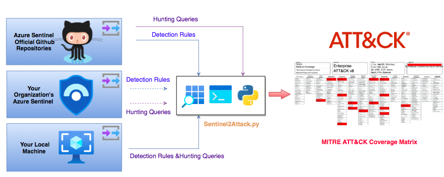

# Sentinel2Attack

This Python code snippet extracts MITRE Framework techniques from: 

* Your local Yaml hunting/detection queries
* The official Azure Sentinel Github repository (Hunting Queries and Detections)
* Your Azure Sentinel 

Then, it generates a json file that you can open with the MITRE ATT&CK navigator to check your coverage. 

:warning: To detect Azure Sentinel Detection/Hunting rules you need to name them as follows: <TechniqueID><Space><Name> e.g "T1055 Process Injection"

:construction: You can use the snippet to build your own Python projects

